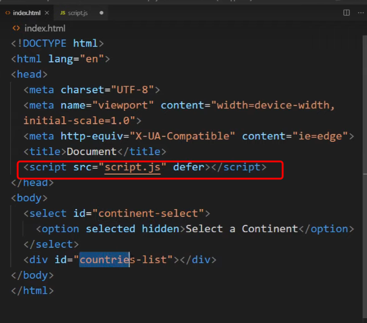
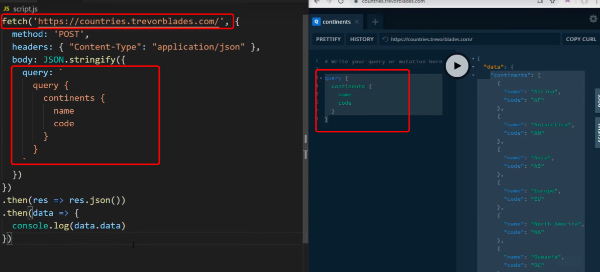
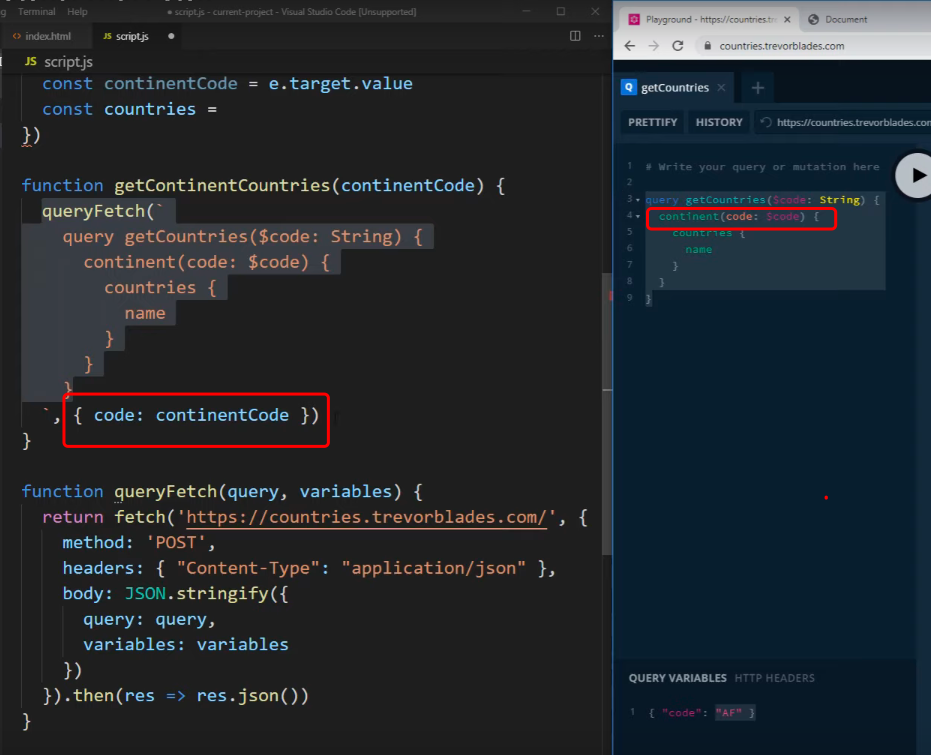

# GraphQL Turorial

> 

# Install Pacakges

> npm i

# Run Server

> nodemon server.js

# In Browser Address Bar

> localhost:5000/graphql

# Query Data

case 1:

```

query{
  books {
    id
    name
    authorId
  }
}
```

case2 (shorthand):

```
{
  books {
    id
    name
    authorId
  }
}
```

case3: id is a parameter

```
query{
  book(id:1){
    name
	}
}

```

case4: id is a parameter, concat author name

```
query{
  book(id:1){
    name,
    author {
      name
    }
	}
}

```

# Mutation( add, delete, update)

case1: add

```
mutation {
  addBook(name:"Great Gasby",authorId:1){
    name
	}
}

```

# GraphQL API vs RESTful API

| GraphQL API                           | RESTful API              |
| ------------------------------------- | ------------------------ |
| a query language                      | an architectural concept |
| a specification                       | an industry standard     |
| limited tools                         | mature , many tools      |
| performance and flexibility           | simplicity               |
| each entity includes multiply objects | from one object          |
| get exactly what you need             | get a complete data set  |
| operate over a single(root) endpoint  | x endpoint: x data       |

# Example
## Using RESTful API, we get different data through different endpoints, 
-  <https://some.com/api/books/1>, {method: get} ;
- <https://some.com/api/clients/2>, {method: delete} 
## By contrast, using GraphQL, we get  different data through one endpoint
- by changing only query and arguments
- 
- a query without arguments
- 
- a query with arguments
- 
