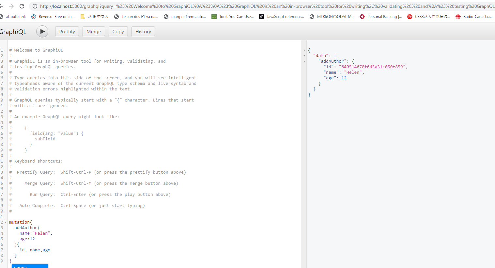

- start app in terminal: node server.js
- in browser address bar: http://localhost:5000/graphql
- GraphQL server on Node.js
- React front-end (with Apollo)
- MongoDB to store data
- 
- mutation (change data )
- 
- query ( = select data from one or multiple tables)
- 
- query with parameters
- 
- mutation with parameters
- 

prerequisites:
1, install mongoDB locally or remotely

2, graphQL

```
mutation{
  addAuthor(
    name:"Helen",
    age:12
  ){
   id, name,age
  }
}

query{
  books {
    id,
    name
  }
}
```
